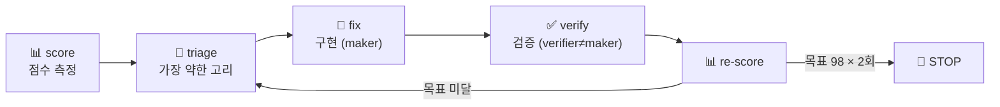

# 🔁 claude-loop

> **"Build the loop, stay the engineer."** — Addy Osmani
>
> 아무 코드 프로젝트에나 까는 **완성도 루프(completeness loop)** Claude Code 스킬.
> "잘 만들어줘"라는 막연한 목표를 **계산 가능한 점수**로 바꾸고, AI 에이전트가 그 점수를 올리게 하되, **숫자를 속이지 못하게** 하고, **끝낼 때를 결정론적으로 정하고**, 머지 판단은 **사람이** 한다.

*A Claude Code skill that turns "make it better" into a measurable score, lets the agent climb it, refuses to let the number be gamed, stops deterministically, and keeps you — the engineer — in charge of merges.*

---

## 🤔 이게 뭔가요?

LLM 에이전트는 **측정 가능한 신호를 최적화**하는 건 잘합니다. 하지만 "이거 잘 만들어줘", "production-ready 로 해줘" 같은 **막연한 목표는 못 합니다** — 무엇이 "잘"인지 모르니까요.

그래서 엔지니어가 하는 일은 직접 코드를 짜는 게 아니라 **루프를 짓는 것**입니다:

> 🎓 **비유**: 시험 공부를 "열심히 해"라고 하면 막연합니다.
> 대신 **모의고사를 봅니다**(점수) → **틀린 단원을 찾고**(triage) → **그 단원을 공부하고**(fix) → **다시 모의고사를 봅니다**(re-score).
> 점수가 목표(예: 98점)에 닿으면 멈춥니다. **공부 자체보다 "이 루프를 설계하는 것"이 핵심**입니다.

`claude-loop` 은 이 루프를 코드 프로젝트에 그대로 적용합니다.



---

## ✨ 무엇을 해주나 — 모드 4개, 진입점 1개

`loop` 스킬 하나에 4개 모드가 있고, **자연어 의도로 자동 분기**합니다(플래그 없음):

| 한마디로 하면 | 모드 | 무슨 일이 일어나나 |
|--------------|------|-------------------|
| "루프 셋업" / "loop init" | **init** | 코드베이스를 스캔하고 몇 가지 인터뷰를 한 뒤, 프로젝트 전용 점수표(`.loop/`)를 만들어줍니다 |
| "완성도 몇 점?" / "재채점" | **score** | 지금 점수를 **실환경 신호**로 측정합니다 |
| "루프 돌려" / **"루프 10라운드 돌려"** | **run [N]** | 루프를 N바퀴 돕니다 |
| "루프 현황" | **status** | 현재 점수·다음 할 일을 보여줍니다 |

### 🎚️ N은 단일 다이얼

```
"루프 돌려"      →  1바퀴 (사람이 보는 앞에서, 라운드 끝에 멈춤)
"루프 10라운드"  →  10바퀴 (무인 — 알아서 돌다가 STOP/문제에서 멈춤)
```

`N=1`은 **신중 모드**(첫 바퀴를 보여주고 사람이 검수), `N≥2`는 **무인 모드**입니다. 별도 플래그 없이 숫자만으로 전환됩니다.

---

## 💡 왜 다른가 — 3가지 핵심

### 1. 🛡️ 숫자를 못 속인다 (anti-gaming)
점수는 "코드가 존재한다"가 아니라 **"실제로 동작한다"**로만 오릅니다.
- ✅ DB 합계가 보존되는가 (`SELECT SUM(...)` 출고 전후 불변)
- ✅ 실데이터로 200 응답이 오는가 / 권한 없는 토큰엔 403인가
- ❌ "테스트 N개 통과", "grep 0건", "빌드 GREEN" **만으로는 점수를 안 올립니다**

> AI가 "테스트를 삭제해서 통과율을 올리는" 식의 꼼수를 막는 유일한 방법입니다.

### 2. 🧑‍✈️ 사람이 루프 안에 (stay the engineer)
- **auto-merge 절대 안 함** — 항상 브랜치만 만들고, 머지는 사람이 합니다
- fix·probe 는 **local 범위만** — prod 쓰기·외부 배포·자격증명·force push 금지
- 첫 바퀴는 항상 보여주고, 나머지를 맡깁니다

### 3. 💾 디스크 = 메모리 (Karpathy 패턴)
루프 상태가 **컨텍스트가 아니라 디스크**(`.loop/*.json`)에 삽니다. 그래서 세션이 끊겨도, 며칠 뒤에도 **`checkpoint.json`에서 그대로 이어집니다**. 멀티라운드를 돌려도 컨텍스트가 폭발하지 않습니다.

---

## 📦 설치

Claude Code 스킬이므로 `~/.claude/skills/loop/` 에 두면 끝입니다:

```bash
git clone https://github.com/bigbulgogiburger/claude-loop ~/.claude/skills/loop
```

이제 Claude Code 세션에서 `loop` 스킬이 자동 인식됩니다. (확인: 새 세션에서 "루프 현황" 또는 "loop init")

---

## 🚀 빠른 시작

```text
나: 루프 셋업해줘
  → [init] 코드베이스 스캔(언어·테스트·기동·DB 자동 탐지) → 인터뷰 5문항
          (목표 / 측정 축 + 가중치 / 각 축을 어떻게 '실제 동작'으로 확인 / 환경 / 목표점수)
          → .loop/ 생성 (loop.yaml · scorecard.md · driver.js)

나: 지금 완성도 몇 점이야?
  → [score] 실환경 probe 로 측정 → "활성 종합 72/100 · 가장 약한 고리: 결제(48)"

나: 루프 돌려
  → [run 1] 결제 고치기 → 검증 → 재채점 → "결제 48→71, 종합 72→76" → 멈춤(사람 검수)

나: 좋아, 루프 10라운드 돌려
  → [run 10] 무인으로 약한 고리부터 차례로 → STOP(98×2) 또는 막힘에서 정지
            → 브랜치 핸드오프 (auto-merge 안 함)
```

---

## ⚙️ 어떻게 작동하나

### 보편 엔진 + 프로젝트 설정

```
~/.claude/skills/loop/        ← 보편 엔진 (이 repo, 모든 프로젝트 공유)
├── SKILL.md                  ← 단일 진입점 (모드 분기)
├── references/               ← 절차 SSoT
│   ├── cycle.md              · 루프 사이클
│   ├── scoring.md            · 점수 함수 (band·가중·정규화·anti-gaming)
│   ├── stop.md               · 종료 로직
│   ├── init-flow.md          · 스캔 + 인터뷰
│   └── safety.md             · local-only 가드
└── templates/                ← init 이 채워 쓰는 틀

<your-project>/.loop/         ← 프로젝트 설정 (init 이 생성)
├── loop.yaml                 ← 측정 축·가중치·probe·환경·목표 (기계 설정)
├── scorecard.md              ← 각 축의 합격 기준 + 점수 이력 (사람이 읽음)
├── scorecard.json            ← 런타임 점수 (디스크=메모리)
├── checkpoint.json           ← 런타임 상태 (다음 할 일·진척)
└── driver.js                 ← 무인 멀티라운드 워크플로
```

엔진은 보편, 프로젝트별 rubric·probe·env 는 `.loop/` 로 **외화**합니다.

### 점수 함수 (요지)

```
1. 사전조건  앱이 살아있나? 죽었으면 'STALE' 표기 (거짓 점수 방지)
2. 측정      축마다 실환경 probe 실행
3. 등급      관찰된 동작 → FULL(80~90) / PARTIAL(40~78) / CONFLICT(25~55) / MISSING(12~30)
4. 합산      가중 blend — 단순 평균 ❌, '가장 약한 고리'가 점수를 지배
5. 정규화    아직 결정 못 한(BLOCKED) 항목은 분모에서 제외
6. 종료      목표 × 연속 N회 → STOP
```

> 자세한 설계 의도와 전체 스펙은 [`DESIGN.md`](./DESIGN.md) 를 보세요.

---

## 🧭 5가지 불변식 (the essence)

이 5개가 깨지면 루프가 의미를 잃습니다:

1. **"잘됨"을 숫자로** — 막연한 목표 금지
2. **숫자를 올린다** — score → triage → fix → verify → rescore
3. **숫자를 못 속인다** — 실환경 신호에 결박 (anti-gaming)
4. **결정론적 종료** — 목표 도달 / 진전 없음 / 막힘에서 자동 정지
5. **사람이 루프 안에** — 브랜치만, auto-merge 금지, local 범위만

---

## 📂 이 repo 구성

| 파일 | 설명 |
|------|------|
| [`SKILL.md`](./SKILL.md) | 스킬 진입점 — 4모드 분기 |
| [`DESIGN.md`](./DESIGN.md) | 전체 설계 스펙 (왜 이렇게 만들었나) |
| [`references/`](./references) | 모드별 절차 SSoT (cycle·scoring·stop·init-flow·safety) |
| [`templates/`](./templates) | `init` 이 채워 쓰는 틀 (loop.yaml·scorecard.md·driver.js) |

---

## 🙏 크레딧

- **Addy Osmani** — *"Build the loop, stay the engineer"* (루프 엔지니어링 사조)
- **Andrej Karpathy** — *"디스크 = 메모리"* (LLM Wiki / build-time 합성 패턴)
- 처음엔 한 프로젝트(Stanley CS) 전용으로 만들었다가, 그 정수만 뽑아 **아무 코드 프로젝트에나 까는 보편 스킬**로 일반화했습니다.

---

> 💬 코드 프로젝트 전용입니다(글쓰기·리서치 루프는 범위 밖). 버그·제안은 Issues 로!
